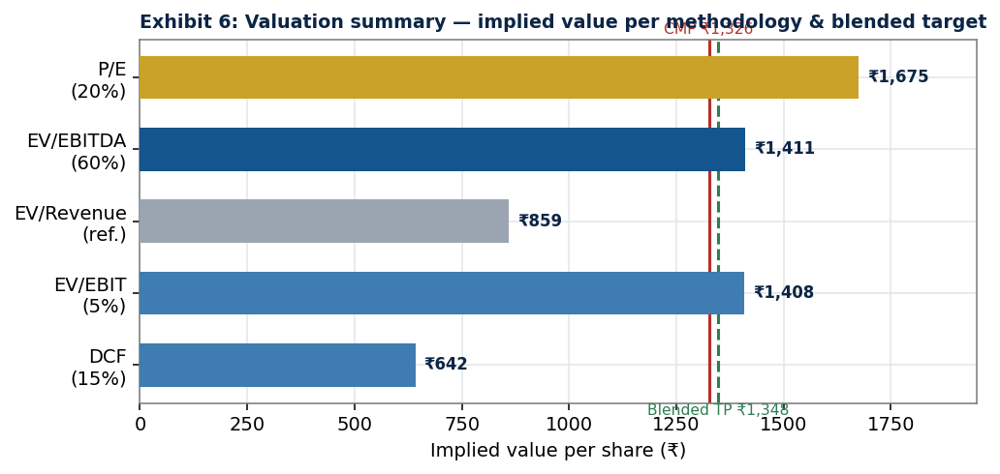
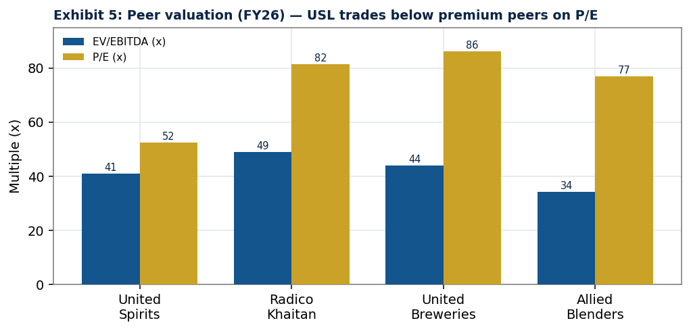
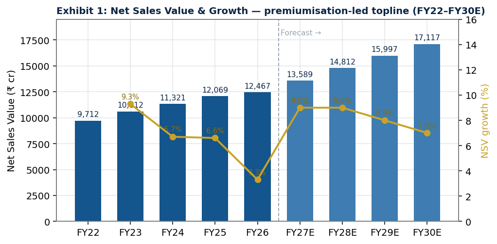
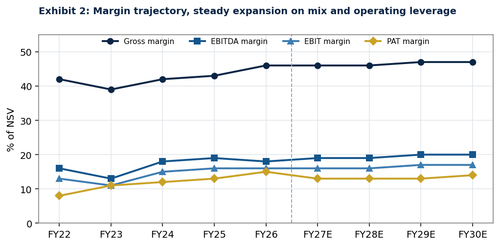
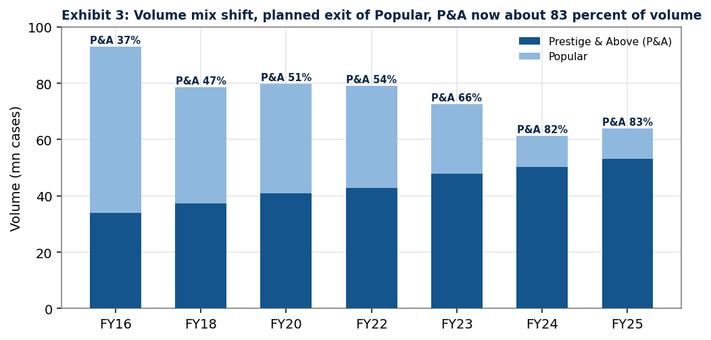
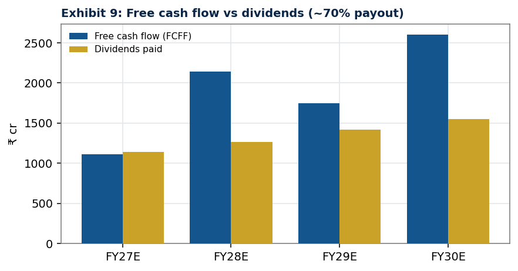
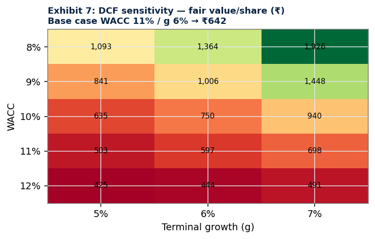
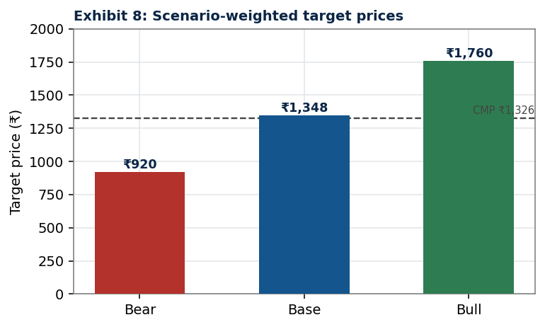
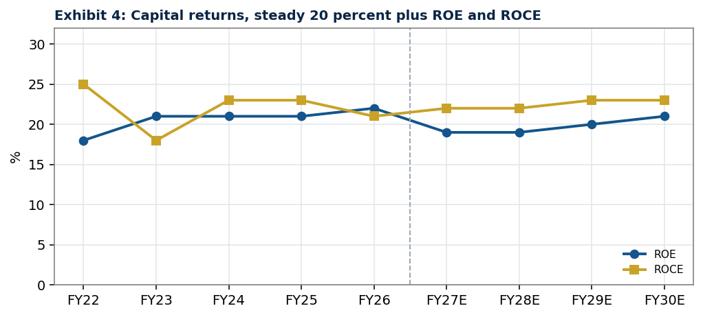

# UNITED SPIRITS LIMITED
### Initiating Coverage | Equity Research Report
**Consumer Staples, Beverages (Spirits) | India**

---

| | |
|---|---|
| **Company** | United Spirits Limited (a Diageo plc Group company) |
| **Tickers** | NSE: **UNITDSPR** &nbsp;•&nbsp; BSE: **532432** |
| **Current Market Price (CMP)** | **₹1,326** |
| **12-Month Target Price** | **₹1,348** |
| **Upside / (Downside)** | **+1.7%** |
| **Recommendation** | **HOLD / NEUTRAL** |
| **52-Week Range** | ₹1,210 - ₹1,489 |
| **Market Capitalisation** | ₹96,453 crore (~US$11.3 bn) |
| **Enterprise Value** | ₹93,726 crore |
| **Shares Outstanding** | 72.74 crore (Face value ₹2) |
| **Free Float** | ~44% (Diageo holds ~56%) |
| **Valuation Basis** | Blended: 60% EV/EBITDA, 20% P/E, 5% EV/EBIT, 15% DCF |
| **Investment Horizon** | 12 months |

**Analyst:** _Senior Equity Research Analyst, CFA_
**Date of Publication:** 25 June 2026

> **Disclaimer:** This report is prepared for academic / capstone and illustrative research purposes (CFA Institute research-reporting standards). It is **not investment advice and not a solicitation** to buy or sell any security. All financial forecasts and valuation outputs are sourced from the uploaded financial model (*United Spirits Excell.xlsx*) and the United Spirits FY2025 Integrated Annual Report; market, industry and macroeconomic context is sourced from public domain references cited inline. Content from third-party sources has been paraphrased for compliance with licensing restrictions.

---

## 1. INVESTMENT SUMMARY

**We initiate coverage on United Spirits Limited (USL) with a HOLD / NEUTRAL rating and a 12-month target price of ₹1,348**, implying ~1.7% upside to the current market price of ₹1,326. USL is, in our view, the highest-quality large-cap proxy for India's structural spirits-premiumisation theme, but after a multi-year re-rating, the current valuation already discounts the bulk of that optimism. The risk-reward is balanced; we would accumulate on weakness below ~₹1,150 and trim above ~₹1,500.

### Investment Thesis (Key Points)

1. **Premiumisation is the durable growth engine.** Prestige & Above (P&A) brands now contribute ~89-90% of net sales value (NSV), up from ~70% five years ago. With Indian premium and luxury spirits growing at low-double-digit rates versus mid-single-digit mainstream volumes, USL's value-led model can sustain ~9-10% NSV growth even as total volumes grow only mid-single-digit.
2. **Unrivalled brand portfolio and Diageo backing.** USL owns/operates a full-ladder portfolio, *McDowell's No.1, Royal Challenge, Signature, Antiquity* (Prestige) through *Black Dog, Black & White, Signature, Godawan, Johnnie Walker, Singleton, Tanqueray, Don Julio, Smirnoff* (Premium & Luxury), backed by parent **Diageo plc (~56% holding)** and its global innovation pipeline.
3. **Structural margin expansion.** EBITDA margin has risen from ~13% (FY23) to ~18% (FY26) and is modelled to reach ~20% by FY30E on mix enrichment, operating leverage and the multi-year supply-agility/productivity programme.
4. **Fortress balance sheet and high returns.** USL is effectively net cash (net debt/EBITDA ~ -1.2x), generates ROCE/ROE of ~20-23%, runs an asset-light manufacturing model, and returns ~70% of profit as dividends.
5. **Crystallised optionality, the RCB monetisation.** In March 2026 USL completed the **₹16,660 crore all-cash sale of the Royal Challengers Bengaluru (RCB) franchise** to an Aditya Birla Group-led consortium, value not captured in our model-derived target price and a meaningful source of potential capital return / re-rating.

### Why HOLD rather than BUY

Our blended fair value of **₹1,348** sits essentially level with the market price. The discounted-cash-flow (DCF) value of **₹642** is well below the market price; the stock's valuation is sustained almost entirely by **rich relative multiples** (~37-39x forward EV/EBITDA, ~56x trailing P/E). This is justified by quality and growth, but it leaves a thin margin of safety. The investment case (business quality) and the valuation case (price already paid for that quality) therefore diverge.

### Valuation Summary (per uploaded model)

| Methodology | Implied Value/Share (₹) | Weight | Contribution (₹) |
|---|--:|--:|--:|
| EV/EBITDA (FY27E, peer median) | 1,411 | 60% | 846 |
| P/E (FY27E, peer median) | 1,675 | 20% | 335 |
| EV/EBIT (FY27E, peer median) | 1,408 | 5% | 70 |
| DCF (FCFF, 2-stage) | 642 | 15% | 96 |
| **Blended Target Price** | | **100%** | **₹1,348** |

### Key Risks
Adverse state excise/tax actions; pricing-approval lags vs input inflation; intensifying premium competition (Pernod Ricard, Radico Khaitan, a recapitalised Tilaknagar Industries, Allied Blenders); customer/geographic concentration (a single state corporation ~30% of revenue); ENA/grain, glass and scotch-concentrate cost volatility; valuation de-rating risk; and ESG/health-policy headwinds.

---

## 2. COMPANY OVERVIEW

### 2.1 History and Ownership
United Spirits Limited is **India's largest beverage-alcohol (alcobev) company** and the local operating company of **Diageo plc**, the world's leading premium-spirits group. USL traces its lineage to the McDowell & Co. and UB (United Breweries) spirits businesses consolidated under the erstwhile UB Group; Diageo acquired control in 2013 (a landmark ~US$1.9 bn transaction, then the largest in India's alcobev sector) and currently holds **~56%** of equity, with the balance ~44% as free float held by institutional and retail investors. The company is listed on the NSE (UNITDSPR) and BSE (532432), with 72.74 crore shares outstanding (₹2 face value).

### 2.2 Business Segments
Post-FY2026, USL reports two segments:
- **Beverage Alcohol (~96%+ of net sales):** the core franchise, manufacturing, sourcing, marketing and selling Indian-Made Foreign Liquor (IMFL): whisky, brandy, rum, vodka and gin across the full price ladder.
- **Sports (held-for-sale / discontinued):** the Royal Challengers Bengaluru (RCB) IPL/WPL franchise, held via Royal Challengers Sports Pvt. Ltd (RCSPL). This was classified as a discontinued operation and **fully divested in March 2026** (see §2.7).

Within beverage alcohol, the portfolio is managed in two tiers:
- **Prestige & Above (P&A)**, the growth/margin driver, **~89% of NSV in FY25** (validated by the FY2025 Integrated Annual Report), spanning Lower/Mid/Upper Prestige, Premium and Luxury.
- **Popular**, mass-market, deliberately de-emphasised. USL franchised/slump-sold a tranche of popular brands in FY2023 to sharpen P&A focus.

### 2.3 Product Portfolio, Key Brands
The portfolio (FY2025 Integrated Annual Report) is anchored by ₹1,000 crore+ "power brands":

| Tier | Representative Brands |
|---|---|
| **Lower / Mid Prestige** | McDowell's No.1 (whisky/brandy/rum), Royal Challenge |
| **Upper Prestige** | Signature, Antiquity, Royal Challenge American Pride |
| **Premium Scotch** | Black & White (USL notes it as the fastest-growing primary Scotch globally, with India its largest market), Black Dog |
| **Luxury / Imported (Diageo portfolio)** | Johnnie Walker, The Singleton, Don Julio (tequila), Tanqueray (gin), Cîroc, Ketel One, Captain Morgan, Baileys |
| **Indian Craft / Luxury Malt** | Godawan (India's most-awarded artisanal single malt, 85+ international accolades) |
| **White Spirits / New-to-World** | Smirnoff (incl. flavours), McDowell's X Series (gin/vodka/rum) |
| **Craft (via Ventures)** | Greater Than & Hāpusa gin (NAO Spirits) |

### 2.4 Manufacturing Footprint
USL runs an **asset-light, geographically dispersed** model: a combination of owned distilleries/bottling units, tie-up/contract manufacturing units (TMUs) and franchisee bottlers across ~40+ facilities. Because alcohol is a State subject with inter-state movement restrictions, production is largely **in-state**, necessitating a distributed footprint. Asset turnover (NSV/net fixed assets) of ~7x and capex of only ~1-2% of NSV reflect this capital-light structure. An ongoing **supply-agility programme** is optimising the network and driving structural cost savings.

### 2.5 Distribution Network
USL reaches consumers through **70,000+ retail outlets** nationwide. India's alcobev route-to-market (RTM) is state-controlled: in many states USL sells to **government beverage corporations** (e.g., TASMAC in Tamil Nadu, Karnataka and Andhra Pradesh corporations) which then control wholesale/retail; elsewhere private wholesale or auction models apply. This creates customer concentration, a single state customer accounts for roughly 30% of revenue, typical for the industry but a structural risk.

### 2.6 The Diageo Relationship
As Diageo's India arm, USL benefits from: (i) access to Diageo's global luxury portfolio (Johnnie Walker, Don Julio, Tanqueray, Singleton); (ii) global R&D, marketing and responsible-drinking frameworks; (iii) conservative treasury and governance discipline; and (iv) a global premiumisation playbook. Notably, India is a **structural growth bright spot** within Diageo's portfolio at a time when the parent has cut global guidance amid US/China weakness (see §5 and §12).

### 2.7 Recent Strategic Developments
- **RCB divestiture (completed March 2026):** USL sold 100% of RCSPL, owner of the RCB IPL & WPL franchise, for **₹16,660 crore (~US$1.7-1.9 bn)** in an all-cash deal to a consortium led by the **Aditya Birla Group**, alongside The Times of India Group, Bolt Ventures and Blackstone (BXPE). The franchise represented ~17% of USL's market capitalisation; brokerages widely viewed the exit as **value-unlocking** for shareholders ([The Hindu](https://www.thehindu.com/sport/cricket/rcb-acquired-by-consortium-for-16600-crore-rupees/article70781258.ece); [Economic Times](https://economictimes.indiatimes.com/markets/stocks/news/cheers-to-ipl-exit-brokerages-say-rs-16660-crore-rcb-stake-sale-will-unlock-value-for-united-spirits/articleshow/129796162.cms)). _Content rephrased for licensing compliance._
- **NAO Spirits acquisition / Ventures:** Through **Diageo India Ventures**, USL has invested in homegrown craft start-ups, **NAO Spirits** (creators of *Greater Than* and *Hāpusa* gin), *Pistola*, *Sober* and *Quaffine*. The FY2025 report discloses an ₹18 crore secured loan to NAO Spirits alongside an equity stake. **Strategic rationale:** the investments give USL early, low-cost exposure to fast-growing Indian craft and "new-to-world" categories (gin, low/no-alcohol), strengthen its premiumisation funnel toward younger, experience-seeking consumers, and build optionality in emerging high-margin niches without large balance-sheet commitment.

---

## 3. INDUSTRY ANALYSIS

### 3.1 Market Structure and Size
India is the **world's third-largest alcoholic-beverage market by volume** and the **largest whisky market**. Total IMFL volumes are estimated at **~410 million cases (2024, IWSR)** and the broader alcohol market at roughly **US$50-70 billion**, growing ~6% CAGR. The IMFL spirits market is effectively an **oligopoly**: USL (Diageo) and Pernod Ricard India are the two majors, followed by Allied Blenders & Distillers (ABDL), Radico Khaitan, Tilaknagar Industries and Globus Spirits, plus regional players. ([Livemint](https://www.livemint.com/companies/news/allied-blenders-and-distillers-officer-s-choice-whisky-market-premium-whisky-imfl-brands-luxury-spirits-11742186175181.html)). _Figures paraphrased for compliance._

### 3.2 Porter's Five Forces

| Force | Intensity | Assessment |
|---|---|---|
| **Threat of New Entrants** | **Low** | High barriers: 30+ distinct state licensing/excise regimes, capital and working-capital intensity (whisky maturation), advertising bans (only surrogate advertising permitted), and entrenched distribution. A new national-scale entrant is highly improbable; craft entrants exist but remain niche. |
| **Bargaining Power of Suppliers** | **Moderate** | Inputs (extra neutral alcohol/grain spirit, scotch concentrate, glass, packaging) can spike cyclically; glass and ENA inflation compressed FY23 margins. Scale and Diageo sourcing partly offset this. |
| **Bargaining Power of Buyers** | **High** | State beverage corporations control pricing and RTM in many states and set maximum retail prices, capping pricing power and lengthening receivables. Concentration (~30% of revenue from one state customer) amplifies this. |
| **Threat of Substitutes** | **Moderate** | Beer, wine, country liquor and (increasingly) low/no-alcohol compete; however, premiumisation and aspiration are shifting consumers toward branded premium spirits. |
| **Competitive Rivalry** | **High & rising** | Intensifying premium competition from Pernod, Radico, ABDL and a recapitalised Tilaknagar (post-Imperial Blue). USL competes on value share, brand equity and portfolio breadth rather than price. |

**Net assessment:** the industry's high entry barriers and structural premiumisation are attractive, but **buyer power (state control) and rising rivalry** cap pricing freedom and returns, supporting premium-but-not-unlimited multiples.

### 3.3 Premiumisation, The Structural Growth Driver
Premiumisation is the single most important structural theme. Industry research indicates **P&A IMFL and premium beer are growing at low-double-digit rates versus mid-single-digit mainstream** ([Financial Express, citing JM Financial Sep-2025](https://www.financialexpress.com/business/industry-the-premium-playbook-how-indian-alcohol-giants-are-engineering-a-profit-boom-4050339/)). Crucially, **luxury spirits represent only ~3% of cases sold but contribute over 20% of industry profits** ([Livemint/IWSR](https://www.livemint.com/companies/news/allied-blenders-and-distillers-officer-s-choice-whisky-market-premium-whisky-imfl-brands-luxury-spirits-11742186175181.html)). **Financial implication for USL:** because USL's mix is ~89-90% P&A, each point of mix enrichment and price/mix gain flows disproportionately to gross and EBITDA margins, the mechanism behind our modelled ~46%→48% gross margin and ~18%→20% EBITDA margin trajectory. Value growth, not volume growth, is the engine. _Industry figures rephrased for compliance._

### 3.4 State Regulation, Taxation and Distribution Barriers
Alcohol sits **outside GST** and is a **State subject**: each state independently controls licensing, pricing approvals, label registration, RTM and **excise duty** (the dominant levy, a pass-through collected from consumers and remitted to states). Because of this, the topline is best tracked on a **Net Sales Value (NSV = revenue net of excise)** basis. Key 2025-26 regulatory developments:
- **Karnataka, Alcohol-in-Beverage (AIB) excise (effective 11 May 2026):** Karnataka became the **first Indian state** to adopt an alcohol-content-based duty within rationalised slabs, **deregulating government price-fixation** so producers set prices by market and alcohol content; the state targets ~₹45,000 crore of excise revenue and is transitioning over 3-4 years ([Hindustan Times](https://www.hindustantimes.com/india-news/karnataka-rolls-out-india-s-first-alcohol-in-beverage-liquor-tax-system-101779029339339.html); [Economic Times](https://economictimes.indiatimes.com/industry/cons-products/liquor/alcohol-in-beverage-karnataka-rolls-out-indias-first-aib-based-excise-duty-regime/articleshow/131152932.cms)). As Karnataka is India's single largest whisky market (~17% of national volumes), greater **pricing freedom is a structural positive** for premium players like USL, though the transition adds near-term uncertainty. _Rephrased for compliance._
- **Prohibition / RTM risk:** dry states (Gujarat, Bihar) and periodic RTM reversals (Delhi, Andhra Pradesh) remain the principal regulatory tail risks.

---

## 4. ECONOMIC AND MACRO ANALYSIS

| Macro Indicator | Reading | Source |
|---|---|---|
| India real GDP growth FY26 | **+7.7%** (Q4 +7.8%); nominal +8.9% | MoSPI / Economic Survey |
| FY27 GDP projection | 6.8-7.2% (Economic Survey); RBI ~7.4% | PRS / RBI |
| Status | Fastest-growing major economy (4th consecutive year) | Economic Survey 2025-26 |
| Demographics | Large young, legal-drinking-age population; rising urbanisation | n/a |

**Transmission to spirits demand.** India's combination of strong nominal GDP growth (~9%), an expanding middle class, rising disposable incomes, rapid urbanisation, and a young, aspirational legal-drinking-age cohort creates a powerful structural tailwind for **value-led** alcobev consumption. Per-capita consumption remains low by global standards, leaving a long runway. Critically, growth is increasingly **"drinking better, not more"**, consumers trading up within categories, which favours USL's premium mix. The main macro risk to the thesis is a discretionary-spending slowdown (high food inflation or weak urban sentiment), which historically prompts **down-trading** that disproportionately affects the upper-premium tier. Sources: [Livemint](https://www.livemint.com/economy/india-economy-gdp-fy26-growth-rbi-private-consumption-government-spending-inflation-11780642175450.html), [Economic Times](https://economictimes.indiatimes.com/news/economy/indicators/india-gdp-growth-7-8-data-q4-fy26-key-insights-key-takeaways-rbi-economic-insights-rbi/articleshow/131527841.cms). _Macro data rephrased for compliance._

---

## 5. COMPETITIVE POSITIONING

USL is the **#1 spirits company in India by volume** and a value leader. Below we benchmark USL against listed peers on the metrics in the uploaded model (FY26 actuals; United Breweries included as a beer-industry reference). Tilaknagar Industries is discussed qualitatively as it is not in the model's comparable set.

### 5.1 Peer Comparison Table (FY2026)

| Company | Revenue (NSV, ₹ cr) | EBITDA (₹ cr) | EBITDA Margin | Mkt Cap (₹ cr) | EV (₹ cr) | EV/EBITDA (x) | P/E (x) |
|---|--:|--:|--:|--:|--:|--:|--:|
| **United Spirits** | 12,467 | 2,279 | 18.3% | 96,453 | 93,726 | 41.1 | 52.5 |
| Radico Khaitan | 6,050 | 1,038 | 17.1% | 50,274 | 50,883 | 49.0 | 81.5 |
| United Breweries (beer ref.) | 9,240 | 824 | 8.9% | 35,605 | 36,350 | 44.1 | 86.2 |
| Allied Blenders & Distillers | 3,923 | 542 | 13.8% | 17,640 | 18,635 | 34.4 | 77.0 |
| **Peer median** | n/a | n/a | n/a | n/a | n/a | **44.1** | **81.5** |

*ROE/ROCE: USL ~20-23% (model); the highest-quality return profile in the peer set on a scale-adjusted basis.*

### 5.2 Competitor Assessment

- **Radico Khaitan**, the fastest-premiumising challenger. FY26 momentum was strong (Q3 EBITDA margin ~17%, gross margin ~47%; luxury/semi-luxury value growth ~50% YoY), led by Rampur single malt, Jaisalmer gin and After Dark deluxe whisky. Trades at a **premium** to USL (~49x EV/EBITDA, ~82x P/E) on faster growth. ([Outlook Business](https://www.outlookbusiness.com/corporate/radico-khaitan-profit-nearly-doubles-to-17946-cr-in-q4), [Quartr](https://quartr.com/events/radico-khaitan-limited-radico-q3-25-26_F46ZqTfU)).
- **Allied Blenders & Distillers (ABDL)**, record FY26 (revenue +11.5%, EBITDA +28.5% to ₹568 cr, margin +163 bps to 14.4%; adjusted PAT +36% to ₹266 cr), pushing premiumisation (ICONiC whisky). Lower-margin than USL but improving fast. ([Quartr](https://quartr.com/events/allied-blenders-and-distillers-limited-abdl-q4-25-26_FeSJt8TL)).
- **Tilaknagar Industries**, leader in brandy (*Mansion House*) that **acquired Pernod Ricard's *Imperial Blue* whisky brand for ~₹4,150 crore EV (€412.6 m) in 2025** (completed Dec-2025), India's largest alcobev deal since Diageo-USL (2013), instantly making it a major whisky player and intensifying mid-premium competition. ([Reuters via Yahoo](https://sg.finance.yahoo.com/news/pernod-ricard-sells-imperial-blue-153657244.html), [The Spirits Business](https://www.thespiritsbusiness.com/2025/12/pernod-completes-imperial-blue-whisky-sale/)).
- **United Breweries (industry reference)**, India's beer leader (also Heineken-controlled); relevant as a substitute category and consumer-wallet competitor rather than a direct spirits peer.
- **Diageo plc (parent)**, provides USL's premium/luxury portfolio and global capabilities; its global softness (see §12) contrasts with India's strength.

**Positioning verdict:** USL has the **broadest portfolio, deepest distribution, strongest returns (ROCE ~22%) and the most defensive (net-cash) balance sheet**, but cedes some top-line growth optics to Radico and faces a re-energised Tilaknagar in mid-premium whisky. Its strategy of prioritising **value share over volume share** is the right one for a premiumising market. _Peer data rephrased for compliance._

---

## 6. FINANCIAL ANALYSIS (Historical, FY2017-FY2026)

*All figures consolidated, NSV (net-of-excise) basis, ₹ crore. Source: United Spirits Excell.xlsx and FY2025 Integrated Annual Report.*

### 6.1 Income Statement Trends

| Metric | FY22 | FY23 | FY24 | FY25 | FY26 |
|---|--:|--:|--:|--:|--:|
| Net Sales Value (NSV) | 9,712 | 10,612 | 11,321 | 12,069 | 12,467 |
| NSV growth % | n/a | +9.3% | +6.7% | +6.6% | +3.3% |
| Gross profit | 4,032 | 4,109 | 4,779 | 5,209 | 5,793 |
| Gross margin % | 42% | 39% | 42% | 43% | 46% |
| EBITDA | 1,595 | 1,417 | 2,000 | 2,236 | 2,279 |
| EBITDA margin % | 16% | 13% | 18% | 19% | 18% |
| EBIT | 1,291 | 1,134 | 1,725 | 1,953 | 1,990 |
| PAT (reported) | 811 | 1,126 | 1,408 | 1,582 | 1,838 |
| PAT margin % | 8% | 11% | 12% | 13% | 15% |

**Read-through.** The defining feature is that **NSV grew every year while total volume fell** (from ~79 mn cases in FY22 to ~64 mn in FY25), a direct consequence of the deliberate Popular exit and premiumisation. Topline is now **realisation-led** (premium mix + state pricing). Gross margin recovered sharply from the FY23 input-cost trough (39%) to ~46% by FY26 as commodity pressures eased and mix enriched. The FY26 result was corroborated by reported numbers, **consolidated NSV ₹12,467 cr (+7.7%), Q4 PAT +28% YoY**, with Q4 EBITDA beating estimates ([Diageo India](https://www.diageoindia.com/en/news-and-media/stories/2026/audited-financial-results-for-the-quarter-and-financial-year-ended-31-march-2026); [NDTV Profit](https://www.ndtvprofit.com/markets/united-spirits-q4-results-profit-jumps-28-margins-expand-dividend-declared-check-record-date-11495722)). _Rephrased for compliance._

### 6.2 Balance Sheet, Leverage and Capital Structure

| Metric | FY22 | FY23 | FY24 | FY25 | FY26 |
|---|--:|--:|--:|--:|--:|
| Debt/Equity (x) | 0.13 | 0.04 | 0.05 | 0.07 | 0.05 |
| Net debt/EBITDA (x) | -0.01 | -0.67 | -0.81 | -1.08 | -1.20 |
| Current ratio (x) | 1.42 | 1.76 | 1.93 | 2.00 | 2.07 |
| Interest coverage (x) | 14.7 | 10.9 | 22.7 | 21.9 | 12.6 |
| Cash & treasury (₹ cr) | 282 | 1,139 | 1,868 | 2,903 | 3,134 |

USL deleveraged from meaningful working-capital borrowings to a **net-cash position (~₹3,134 cr at FY26, net debt/EBITDA ~ -1.2x)**, reflecting strong internal cash generation and Diageo's conservative treasury discipline. Conventional interest cost is now immaterial (lease interest dominates). This fortress balance sheet underpins the dividend and provides ample flexibility, now augmented by ₹16,660 cr of RCB proceeds.

### 6.3 Working Capital
The model holds steady-state working-capital assumptions: **receivables ~97 days, inventory ~135 days, payables ~104 days**. Inventory is structurally high because premium whisky requires **maturation** (ageing of scotch/grain spirit); receivables are elevated by dependence on **state beverage corporations**, whose payment cycles USL cannot fully control. This is a **working-capital-intensive** model and the principal drag on free-cash conversion.

### 6.4 Cash Flow and Cash Conversion

Operating cash flow (CFO) was ~₹1,459 cr in FY26; capex is consistently small (~₹180-330 cr p.a., ~1-2% of NSV) given the asset-light model. The combination of healthy CFO, low capex and ~70% dividend payout makes USL a reliable cash compounder, although working-capital build in growth years moderates free-cash conversion in any given year.

---

## 7. FORECAST ANALYSIS (FY2027E-FY2030E)

*FY2026 is the last actual; forecasts are the continuing beverage-alcohol business per the uploaded model.*

### 7.1 Forecast Summary

| ₹ crore | FY26 | FY27E | FY28E | FY29E | FY30E |
|---|--:|--:|--:|--:|--:|
| Net Sales Value (NSV) | 12,467 | 13,589 | 14,812 | 15,997 | 17,117 |
| NSV growth % | +3.3% | +9.0% | +9.0% | +8.0% | +7.0% |
| EBITDA | 2,279 | 2,547 | 2,851 | 3,159 | 3,465 |
| EBITDA margin % | 18.3% | 18.7% | 19.2% | 19.7% | 20.2% |
| EBIT | 1,990 | 2,170 | 2,433 | 2,700 | 2,965 |
| PAT | 1,838* | 1,709 | 1,891 | 2,119 | 2,318 |
| EPS (₹) | 25.3* | 23.5 | 26.0 | 29.1 | 31.9 |

*FY26 PAT/EPS include one-off/discontinued-operation items; FY27E reflects normalised continuing operations, hence the optical year-on-year dip.*

### 7.2 Revenue Drivers and Assumptions
- **Premiumisation & mix:** continued P&A salience gains (toward ~90%+ of NSV) and trade-up within categories drive realisation growth.
- **Volume growth:** mid-single-digit, now that the Popular-exit drag has been lapped; reported volume grows with the premium portfolio.
- **Pricing:** state-by-state price increases; the Karnataka AIB deregulation (§3.4) could improve pricing freedom over time.
- **New products:** white spirits (Smirnoff/McDowell's X Series), luxury malts (Godawan) and craft (NAO) extend the funnel.
- **Net result:** NSV growth of ~9-10% tapering toward ~7%, consistent with management's medium-term double-digit topline ambition.

### 7.3 Margin Drivers
EBITDA margin expands ~40-50 bps per year (18.3%→~20.2%) on (i) **mix enrichment** lifting gross margin (~46%→48%); (ii) **operating leverage** on employee and overhead costs as NSV compounds; and (iii) **supply-agility productivity savings**, partly reinvested in A&P to sustain premium brand-building. We deliberately stop short of the >22% margins implied by bulls, given state-gated pricing and intensifying competition.

### 7.4 Key Model Assumptions (uploaded model)

| Assumption | Value | Basis |
|---|--:|---|
| Effective tax rate | 25% | Normalised |
| Dividend payout | 70% | Held at FY26 level |
| Receivable / Inventory / Payable days | 97 / 135 / 104 | 10-yr / 3-yr medians |
| Capex | ~1-2% of NSV | 4-5 yr median |
| Depreciation useful life | 16 years | ~1/6.2% avg |
| Treasury yield | market yield on deposits/MFs | n/a |

---

## 8. VALUATION

We adopt the uploaded model's **blended methodology**, emphasising relative multiples (forward-looking, market-anchored) with a DCF cross-check.

### 8.1 DCF Valuation (FCFF, 2-stage)

| Parameter | Value |
|---|--:|
| Risk-free rate (10-yr G-Sec) | 7.0% |
| Equity risk premium (Rm - Rf) | 4.0% |
| Adjusted beta (0.67 × 0.89 + 0.33) | 0.92 |
| Cost of equity (CAPM) | 11.0% |
| **WACC** (debt negligible) | **11.0%** |
| Terminal growth (g) | 6.0% |
| Sum of PV of explicit FCFF (FY27-34) | ₹11,269 cr |
| PV of terminal value | ₹32,721 cr |
| **Enterprise Value** | **₹43,990 cr** |
| (+) Cash | ₹3,134 cr |
| (-) Debt | ₹407 cr |
| **Equity Value** | **₹46,717 cr** |
| Shares outstanding | 72.74 cr |
| **DCF Value per Share** | **₹642** |

**WACC build:** a defensive consumer-staple with a net-cash balance sheet warrants a low beta (0.92 adjusted) and an equity-funded WACC of ~11%. **FCF assumptions:** NOPAT on a 25% tax rate, plus D&A, less modest capex and working-capital investment; terminal growth of 6% approximates India's long-run nominal consumption growth.

**Honest finding:** even on supportive inputs, the DCF yields **~₹642**, well below the market price. High working-capital intensity depresses free-cash conversion, and the market is implicitly applying a lower discount rate / higher perpetual growth than our base case. The DCF therefore functions as a **valuation floor / sanity check**, which is why it carries only a 15% blend weight.

### 8.2 Relative Valuation
Applying **peer-median forward (FY27E) multiples** to USL's forecast metrics yields:

| Multiple | Peer median (x) | Implied Value/Share (₹) |
|---|--:|--:|
| EV/EBITDA | 39.2 | 1,411 |
| P/E | 71.3 | 1,675 |
| EV/EBIT | 45.9 | 1,408 |
| EV/Revenue (reference) | 4.4 | 859 |

**Peer selection:** Radico Khaitan, United Breweries and Allied Blenders, the closest listed Indian alcobev comparables. **Premium/discount justification:** USL trades at a **discount to the fastest-growing premium peer (Radico) on P/E** but a premium to mass-market peers; this is appropriate given USL's leadership, mix and superior returns, while its slower headline growth versus Radico caps the premium. Multiples therefore frame USL as **fully, but not egregiously, valued**.

### 8.3 Target Price Methodology and Weights
We adopt the uploaded model's weighting scheme, which **leans on relative valuation (85%) over DCF (15%)**:

| Method | Weight | Rationale |
|---|--:|---|
| EV/EBITDA | 60% | Capital-structure-neutral, the market's primary lens for staples; most reliable cross-peer metric |
| P/E | 20% | Captures earnings power and the equity-investor lens |
| EV/EBIT | 5% | Secondary cross-check on operating value |
| DCF | 15% | Long-horizon intrinsic anchor; down-weighted due to terminal-value sensitivity and WC-driven FCF volatility |

**Justification of the DCF/relative split.** The heavier relative weighting reflects: (i) **forecast visibility**, multi-year cash flows for a state-regulated, working-capital-intensive business carry wide confidence intervals, making the DCF terminal value highly sensitive (see Exhibit 7); (ii) **industry maturity**, a deep set of listed, actively-traded Indian alcobev comparables makes market multiples informative and current; and (iii) **reliability of market multiples**, for a high-quality, widely-followed staple, traded multiples capture the market's premiumisation/quality premium better than a single discount-rate assumption. We regard this as a reasonable, if relative-valuation-tilted, framework; a more DCF-weighted analyst would arrive at a lower fair value.

| Method | Implied (₹) | Weight | Contribution (₹) |
|---|--:|--:|--:|
| EV/EBITDA | 1,411 | 60% | 846 |
| P/E | 1,675 | 20% | 335 |
| EV/EBIT | 1,408 | 5% | 70 |
| DCF | 642 | 15% | 96 |
| **Blended Target Price** | | | **₹1,348** |

### 8.4 Upside not in the Target, RCB Proceeds
The model-derived ₹1,348 target **does not capitalise the ₹16,660 crore RCB sale proceeds** (~17% of market cap). Net of taxes/leakage and depending on redeployment (special dividend, buyback, or core reinvestment), this represents a **material upside option** to the target and a key reason we rate HOLD rather than Reduce.

---

## 9. ESG ANALYSIS

USL's ESG agenda, **"Spirit of Progress"** (aligned to Diageo's global framework), is a genuine competitive and risk-mitigation asset (FY2025 Integrated Annual Report).

### 9.1 Environmental
- **Water:** ~54% improvement in water used per litre of spirit distilled vs FY2020 baseline; ~671k kilolitres consumed; "Preserve Water for Life" stewardship, replenishment and regenerative-agriculture programmes (incl. the Godavari Initiative).
- **Energy & emissions:** **99% renewable energy** in direct operations (since FY2020); **~93% reduction in absolute Scope 1 & 2 GHG emissions** vs FY2020 baseline (Scope 2 market-based effectively zero after i-RECs).
- **Net Zero roadmap:** Net Zero in **direct operations by 2030**; across the value chain by **2050**.

### 9.2 Social
- **Responsible drinking:** ~0.7 million people educated through programmes (Act Smart India on underage drinking; DRINKiQ).
- **People:** ~2,400+ employees, ~86% retention, ~89% engagement, ~28% women's representation, with active inclusion & diversity initiatives.

### 9.3 Governance
- Diageo governance standards and board oversight; robust corporate-governance framework; Diageo Marketing Code and consumer-information standards; conservative treasury policy.

### 9.4 Impact on Valuation & Risk
Strong ESG execution **reduces regulatory and reputational tail-risk** (a sector under perennial health/policy scrutiny), supports the premium-brand equity that underpins pricing, and is consistent with the low beta used in our WACC. We do not assign an explicit valuation premium but view USL's ESG leadership as **supportive of multiple durability and a lower cost of capital** over time. _ESG metrics sourced from the FY2025 Integrated Annual Report._

---

## 10. RISK ANALYSIS

### 10.1 Risk Matrix

| Risk | Likelihood | Impact | Mitigant |
|---|---|---|---|
| **Regulatory / RTM disruption** (state policy reversals, prohibition) | Medium | High | Geographic diversification across 30+ states; Diageo compliance |
| **Excise / tax increases not passed through** | Medium-High | Medium-High | Premium mix, brand pricing power, AIB pricing freedom (Karnataka) |
| **Raw-material inflation** (ENA/grain, glass, scotch concentrate) | Medium | Medium | Scale sourcing, supply-agility savings, productivity |
| **Competitive pressure** (Pernod, Radico, Tilaknagar, ABDL) | High | Medium | Portfolio breadth, distribution, value-share focus |
| **Consumer down-trading** (macro slowdown) | Medium | Medium-High | Full price-ladder portfolio; mass-to-premium funnel |
| **Currency / import cost** (scotch concentrate, GBP/USD) | Medium | Low-Medium | Local production; partial hedging |
| **Customer concentration** (~30% one state corporation) | Structural | Medium | Industry-wide norm; receivables management |
| **ESG / health-policy headwinds** (advertising bans, taxation) | Medium | Medium | ESG leadership, responsible-drinking programmes |
| **Valuation de-rating** (rich multiple) | Medium | High | Quality, growth, RCB cash optionality |

### 10.2 International / Global Risk Context
While USL is a **domestic IMFL** business (limiting direct US-tariff exposure), the global backdrop is relevant: IWSR data show **global beverage-alcohol volumes fell ~2% in 2025 (third straight year)**, premiumisation has **"stalled"/fragmented** amid macro pressure, and **US tariffs cut Scotch exports to the US ~15% by volume**. Parent **Diageo cut FY26 guidance** on US/China weakness and tariffs, reduced its dividend (Feb-2026), and is pursuing selective disposals (the RCB exit fits this) ([IWSR](https://www.theiwsr.com/insight/a-major-reset-beverage-alcohol-volumes-fall-again-in-2025/); [The Spirits Business](https://www.thespiritsbusiness.com/2026/02/tariffs-drag-scotch-exports-to-us-down-by-15/); [Diageo](https://www.diageo.com/en/news-and-media/press-releases/2026/diageo-aide-memoire-h1-fiscal-2026)). **Implication:** India stands out as a structural growth engine within a stagnant global spirits market, a relative positive for USL, though scotch-concentrate input costs and parent-level strategy shifts bear watching. _Global data rephrased for compliance._

---

## 11. INVESTMENT RECOMMENDATION

| | |
|---|---|
| **Recommendation** | **HOLD / NEUTRAL** |
| **12-Month Target Price** | **₹1,348** |
| **Current Market Price** | ₹1,326 |
| **Expected Total Return** | ~+1.7% price + ~1.0% dividend yield ≈ **~3%** |
| **Investment Horizon** | 12 months |

**Rationale.** USL is a best-in-class, structurally advantaged compounder, the cleanest large-cap proxy for Indian spirits premiumisation, with a fortress (net-cash) balance sheet, ~22% ROCE and a multi-year margin runway. However, the **business case and the valuation case diverge**: at ~37-39x forward EV/EBITDA and ~52x trailing earnings, the stock already discounts years of double-digit growth and margin expansion. Our blended fair value of **₹1,348** sits essentially at the market price, and the DCF floor (₹642) underscores how much of the valuation rests on sustained premium multiples.

**Why USL deserves a premium to mass-market peers (but not to Radico).** USL warrants a premium over ABDL/Globus for its leadership, portfolio breadth, ~89-90% P&A mix, superior returns and balance-sheet strength. It trades at a **discount to Radico Khaitan**, whose faster top-line and luxury growth command a higher multiple, a gap we view as fair given USL's larger, more mature base.

**Scenario-weighted view.**

| Scenario | Key assumptions | Target (₹) | vs CMP |
|---|---|--:|--:|
| **Bull** | Volume +6%, realisation +6%, EBITDA margin →~24%, lower WACC, RCB cash redeployed accretively | ~1,760 | +33% |
| **Base** | Volume +4-4.5%, realisation +5%, margin →~20%, WACC 11%/g 6% | **1,348** | +1.7% |
| **Bear** | Volume +2.5%, realisation +4%, margin stalls ~17%, de-rating, adverse excise | ~920 | -31% |

**Action.** *Hold* core positions for compounding and the un-modelled RCB-cash optionality. **Accumulate below ~₹1,150** (where the DCF/relative blend turns clearly positive); **trim above ~₹1,500**. Key catalysts to monitor: redeployment of RCB proceeds (special dividend / buyback), Karnataka AIB pricing outcomes, P&A volume momentum, input-cost trajectory, and Diageo's August-2026 global strategy refresh.

---

## 12. APPENDICES

### Appendix A, Integrated Income Statement (₹ cr, NSV basis)
| | FY22 | FY23 | FY24 | FY25 | FY26 | FY27E | FY28E | FY29E | FY30E |
|---|--:|--:|--:|--:|--:|--:|--:|--:|--:|
| NSV | 9,712 | 10,612 | 11,321 | 12,069 | 12,467 | 13,589 | 14,812 | 15,997 | 17,117 |
| COGS | 5,681 | 6,503 | 6,542 | 6,860 | 6,674 | 7,406 | 7,999 | 8,558 | 9,072 |
| Gross profit | 4,032 | 4,109 | 4,779 | 5,209 | 5,793 | 6,183 | 6,814 | 7,439 | 8,045 |
| EBITDA | 1,595 | 1,417 | 2,000 | 2,236 | 2,279 | 2,547 | 2,851 | 3,159 | 3,465 |
| EBIT | 1,291 | 1,134 | 1,725 | 1,953 | 1,990 | 2,170 | 2,433 | 2,700 | 2,965 |
| PAT | 811 | 1,126 | 1,408 | 1,582 | 1,838 | 1,709 | 1,891 | 2,119 | 2,318 |

### Appendix B, Key Ratios
| | FY24 | FY25 | FY26 | FY27E | FY28E | FY29E | FY30E |
|---|--:|--:|--:|--:|--:|--:|--:|
| Gross margin | 42% | 43% | 46% | 46% | 46% | 47% | 47% |
| EBITDA margin | 18% | 19% | 18% | 19% | 19% | 20% | 20% |
| ROE | 21% | 21% | 22% | 19% | 19% | 20% | 21% |
| ROCE | 23% | 23% | 21% | 22% | 22% | 23% | 23% |
| Net debt/EBITDA | -0.8 | -1.1 | -1.2 | -1.1 | -1.0 | -1.1 | -1.1 |

### Appendix C, Cash Flow Summary (₹ cr)
| | FY26 | FY27E | FY28E | FY29E | FY30E |
|---|--:|--:|--:|--:|--:|
| CFO | 1,459 | 1,292 | 2,345 | 1,957 | 2,831 |
| Capex | (181) | (204) | (222) | (240) | (257) |
| Dividends paid | (1,263) | (1,145) | (1,267) | (1,420) | (1,553) |

### Appendix D, Sources
**Primary (per analyst mandate):** United Spirits *United Spirits Excell.xlsx* financial model (DCF, Comps, Valuation Summary, P&L, Balance Sheet, Cash Flow, Ratio Analysis, Beta); United Spirits Annual Reports FY2017, FY2019, FY2021, FY2023 and **FY2025 Integrated Annual Report**.
**Secondary (public domain, cited inline):** Diageo India / Diageo plc investor communications; IWSR; The Hindu; Economic Times; Livemint; Mint; Financial Express; Hindustan Times; NDTV Profit; Reuters; Outlook Business; The Spirits Business; Quartr; PRS / Economic Survey 2025-26; MoSPI; RBI.

*All third-party content paraphrased/summarised for compliance with licensing restrictions. This document is an educational research report and does not constitute investment advice.*
